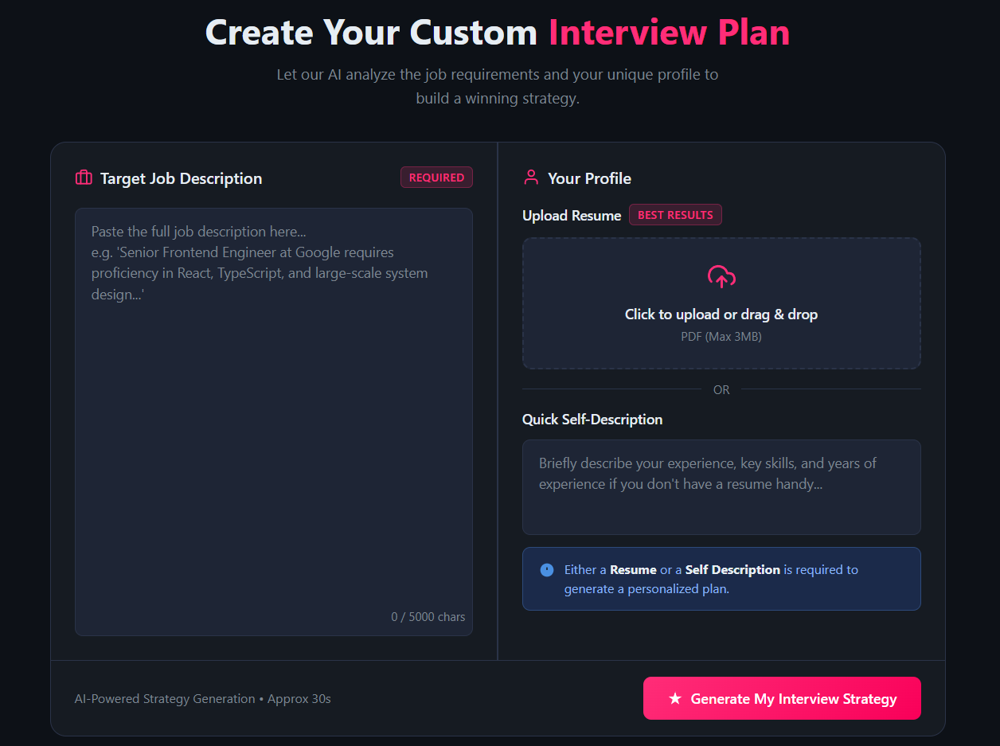
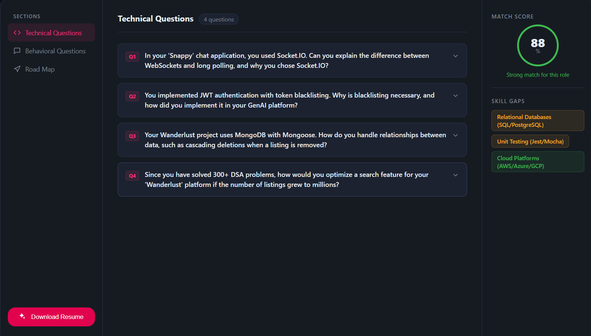
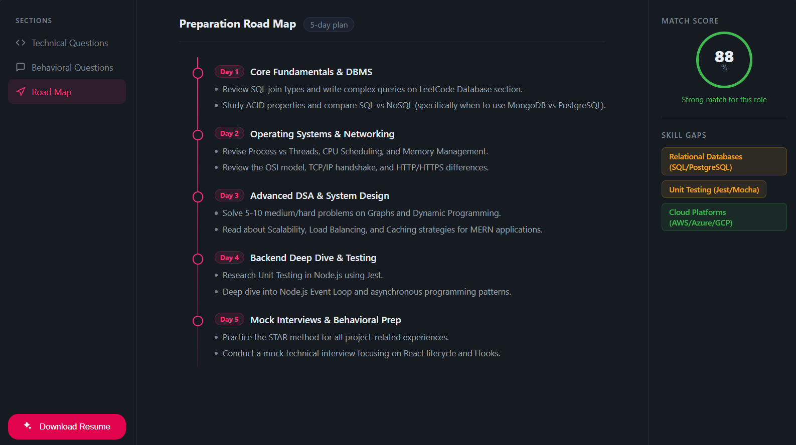
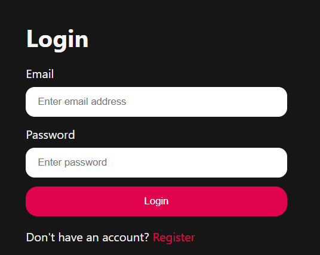

# CareerPrep Ai- An AI Interview Preparation Platform

An AI-powered interview preparation platform that analyzes a candidate's profile and a target job description to generate personalized interview questions, skill-gap analysis, match scores, and a structured preparation roadmap.

🔗 **Live Demo:** [careerprep-ai-frontend.onrender.com](https://careerprep-ai-frontend.onrender.com)

> Hosted on a free tier, so the first load may take up to a minute.
> **Demo login:** `demo@example.com` / `Demo@1234`

## Features

* User Authentication with JWT
* Resume Upload (PDF/DOCX)
* AI-Powered Interview Question Generation
* Technical Interview Questions
* Behavioral Interview Questions
* Personalized Preparation Roadmap
* Match Score Analysis
* Skill Gap Identification
* Interview History Tracking
* Resume Download Support

## Screenshots

| Dashboard | Interview Report |
|---|---|
|  |  |

| Skill Gap & Roadmap | Login |
|---|---|
|  |  |

## Tech Stack

### Frontend

* React.js
* Vite
* React Router
* Axios
* SCSS

### Backend

* Node.js
* Express.js
* MongoDB Atlas
* Mongoose
* JWT Authentication
* Multer
* PDF Parser
* Puppeteer
* Zod

### AI

* Google Gemini API

## Project Workflow

1. User registers or logs in.
2. User uploads a resume or enters a self-description.
3. User provides a target job description.
4. AI analyzes both inputs.
5. The system generates:

   * Technical interview questions
   * Behavioral interview questions
   * Match score
   * Skill gap analysis
   * Personalized preparation roadmap

## Installation

### Clone Repository

```bash
git clone https://github.com/anshu6646/Job_preparation_ai.git
cd Job_preparation_ai.git
```

### Backend Setup

```bash
cd Backend
npm install
```

Create a `.env` file:

```env
MONGO_URI=your_mongodb_connection_string
JWT_SECRET=your_secret_key
GOOGLE_GENAI_API_KEY=your_gemini_api_key
```

Start Backend:

```bash
npm run dev
```

### Frontend Setup

```bash
cd Frontend
npm install
npm run dev
```

Frontend runs on:

```text
http://localhost:5173
```

Backend runs on:

```text
http://localhost:3000
```

## Future Improvements

* Company-specific interview preparation
* Voice-based mock interviews
* AI interview feedback
* User analytics dashboard
* Interview performance tracking
* Multi-model AI support
* Dark/Light theme support


## Author
Anshu Dhaker

Built using React, Node.js, MongoDB, and Google Gemini AI.
